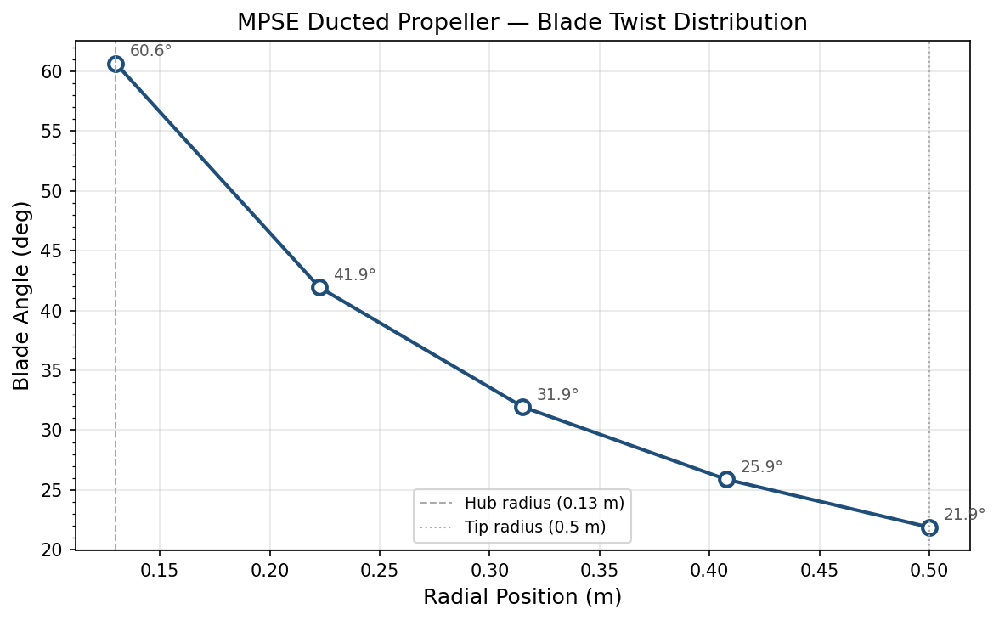
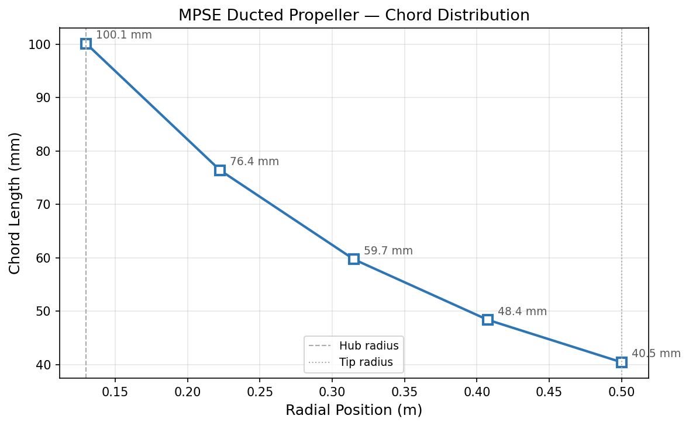
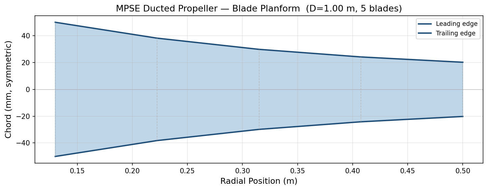

# HOEPS — Hub-Embedded Outrunner Propulsion System

### Analytical Design and CFD Analysis Pipeline for Solar Electric Aircraft

A Python engineering toolkit implementing the complete multi-domain design of a hub-embedded outrunner BLDC motor propulsion system for lightweight solar electric aircraft.

**Research sponsored by Karnataka State Council for Science and Technology (KSCST), Ref: 44S_BE_2684**  
Vinay Kashyap H R — KIT Mangalore, Dept. of Aeronautical Engineering, VTU — 2020-21

---

## What is HOEPS

Conventional electric aircraft propulsion uses an inrunner or shafted outrunner motor connected to a propeller through a central shaft. HOEPS eliminates the shaft entirely by embedding the outrunner BLDC motor rotor directly within the propeller hub.

This architecture:
- Increases effective rotor inertia (I ∝ r²) — improving resistance to variable aerodynamic loading
- Eliminates shaft mechanical losses and shaft weight
- Reduces total system volume within the ducted configuration
- Produces measurably higher thrust at equivalent torque demand

HOEPS is architecturally distinct from rim-driven fan (RDF) technology — where the motor occupies the blade tip region. The hub-embedded approach concentrates inertia at the hub diameter, not the tip.

CFD comparison result: HOEPS configuration achieves **53.3% higher thrust** (309.5 N vs 201.9 N) with **3.7% lower torque demand** (41.4 Nm vs 43.0 Nm) compared to an equivalent shafted configuration.

---

## What this project does

This codebase implements the full analytical design pipeline across four engineering domains:

1. **Motor analytical sizing** — magnetic circuit method for outrunner BLDC motor geometry using SmCo28 permanent magnets and 10JNEX900 amorphous electrical steel
2. **Motor performance estimation** — analytical copper loss, core loss, and efficiency prediction against Ansys Maxwell FEM reference
3. **Ducted propeller BEM design** — vortex-corrected Blade Element Momentum theory for a matched 5-bladed ducted axial fan
4. **CFD results comparison** — structured performance analysis of shafted vs hub-embedded configurations

---

## Results

### Propeller blade geometry (BEM design point)

| Radial Position (m) | Blade Angle (deg) | Chord (m) |
|---|---|---|
| 0.130 (hub) | 60.63 | 0.10013 |
| 0.2225 | 41.94 | 0.07641 |
| 0.3150 | 31.95 | 0.05972 |
| 0.4075 | 25.90 | 0.04839 |
| 0.500 (tip) | 21.89 | 0.04045 |

Design point aerodynamic efficiency: **92.8%**

### Blade geometry plots





### CFD configuration comparison

| Metric | Shafted | HOEPS |
|---|---|---|
| Mean Torque (Nm) | 43.0 | 41.4 |
| Total Thrust (N) | 201.9 | 309.5 |
| Exit Velocity (m/s) | 27.1 | 30.8 |

**Thrust improvement: +53.3% (+107.6 N)**  
**Torque reduction: −3.7% (−1.6 Nm)**

---

## Motor design specifications

| Parameter | Value |
|---|---|
| Rated Power | 13 kW |
| Rated Speed | 2277 rpm |
| Rated Torque | 52.17 Nm (FEM) |
| Efficiency | 89.78% (FEM) |
| Configuration | Outrunner, 20 poles, 24 slots |
| Magnet Material | SmCo28 (Br = 1.07 T) |
| Core Material | 10JNEX900 amorphous steel |
| Phase Current | 34.65 A |

---

## Project structure

```
hoeps/
├── __main__.py                # Full design pipeline runner
├── motor/
│   ├── materials.py           # SmCo28 and 10JNEX900 material dataclasses
│   ├── sizing.py              # Magnetic circuit sizing equations
│   └── performance.py         # Copper loss, core loss, efficiency estimation
├── propeller/
│   ├── bem.py                 # BEM propeller designer (core module)
│   └── geometry.py            # Blade geometry plots
├── cfd/
│   ├── results.py             # CFD result data from SolidWorks Flow Simulation
│   └── comparison.py          # Performance metrics and configuration comparison
└── utils/
    └── units.py               # Physical constants and unit conversions
```

---

## Quick start

```bash
git clone https://github.com/vinaykashyaphr/hoeps
cd hoeps
pip install numpy scipy matplotlib
python __main__.py
```

Outputs:
- Motor sizing table (reproduces analytical design from KSCST report)
- Motor performance estimation vs Ansys Maxwell FEM reference
- Propeller blade geometry table (BEM design)
- Blade geometry plots saved to `plots/`
- CFD configuration comparison

---

## Physical equations implemented

**Motor torque — magnetic circuit method:**
```
T = (π / √6) × q × Bg × Dso² × L
```

**Electrical loading:**
```
q = hs × J × kcu × ws / (ws + wt)
```

**BEM stage work and mass flow:**
```
P = ṁ × u × vt     where     ṁ = ρ × A × V
```

**Blade inflow angle:**
```
φ = arctan(V / (u × (1 − a)))
```

**Blade chord from circulation:**
```
c = (4π × K) / (Cl × B × W)     where     K = r × vt
```

---

## Known limitations and planned extensions

The original CFD was conducted at 900 rad/s angular velocity. The motor analytical design point is 238 rad/s (2277 rpm). This operating point discrepancy is a known gap being addressed in the extended research.

Planned work:

- [ ] 2D magnetostatic FEM solver in C++ — replacing Ansys Maxwell RMxprt
- [ ] BEM reimplementation in C++ with Eigen for sparse linear algebra
- [ ] 2D finite volume CFD solver in C++ — replacing SolidWorks Flow Simulation
- [ ] Mesh independence study at correct motor operating point (238 rad/s)
- [ ] Turbulence model comparison
- [ ] Extended publication targeting Aerospace Science and Technology or Journal of Propulsion and Power

---

## References

1. Adkins, C.N. — Design of Optimum Propellers, Journal of Propulsion and Power, 1994
2. Page, G.S. — Design and Analysis of Single and Dual Rotation Ducted Fans, AIAA, 1996
3. Cagan, N. — Design of an Outer-Rotor BLDC Motor for CMG Applications, METU, 2015
4. Versteeg, H.K. and Malalasekera, W. — An Introduction to Computational Fluid Dynamics, Pearson, 2007

---

## License

MIT
